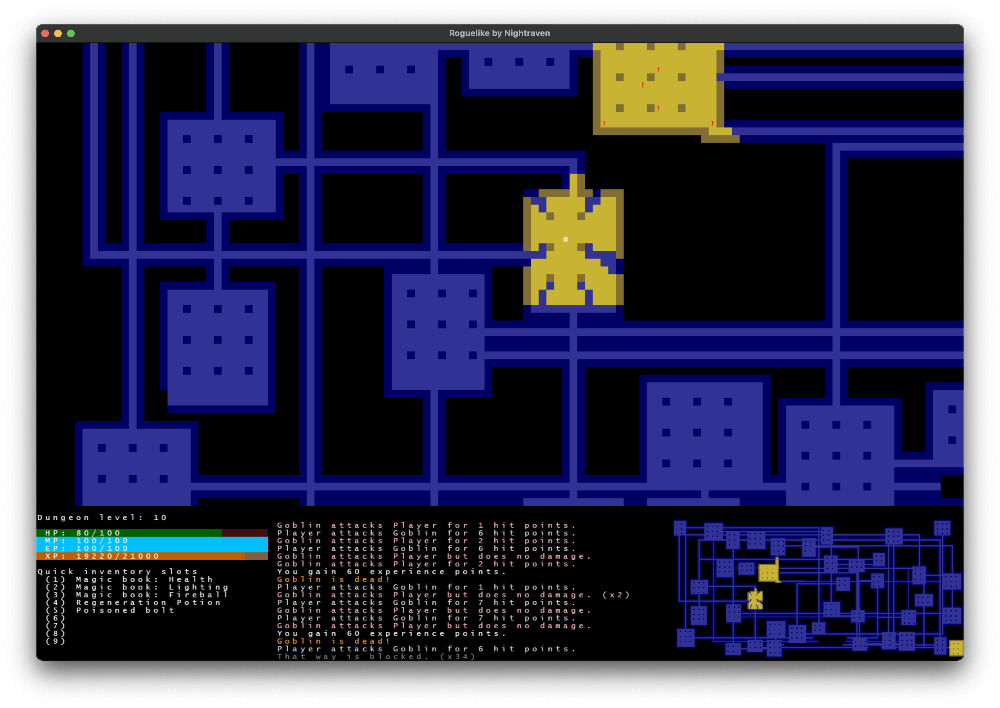
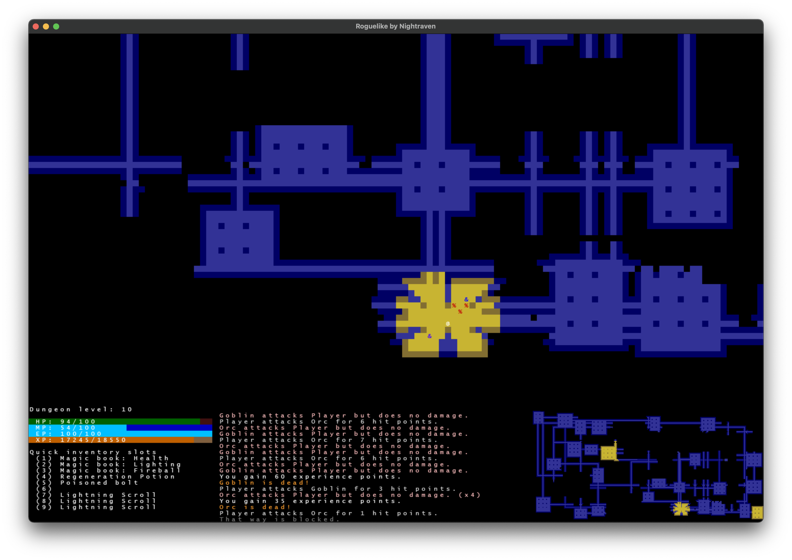

# Wandering shadows



"Wandering shadows" is а roguelike game written in Python (3.10 version) and tcod library.

You are an adventurer in forgotten dungeon full of shadows in the form of various creatures.

## Instructions

After starting the app, you will see the intro screen where you can choose either to start a new game or continue
previous.


You can move around the floor using arrows or numpad (with "`yubn`" keys for diagonal moves) and also skip turns (period
or "`z`" keys). Character location is displayed by "`@`" symbol, other symbols are items and enemies. Symbol "`>`" is
staircase to the next floor, you can use it as soon as you find it (press Shift and period keys).

There is floor minimap in right bottom corner, it shows explored and visible part of floor in same manner as main map.
To mark some rooms or tunnels you can put where torches using "`t`" key and collect them back, you have unlimited number
of torches in inventory. It can be useful on big maps to mark staircase or rooms with potions/scrolls.



To pick item from floor use "`g`" key (or use "`f`" to use item from floor). To use item from inventory you need to open
inventory list ("`i`" key, or "`p`", "`m`", "`q`" as shortcuts for potions, magic items and equipment) and when
press "`a-z`" to choose item. You can also inspect items characteristics by pressing "`e`" and choosing item. At
inventory screen you can use left/right arrows to navigate over inventory pages. One page currently contain 26 items at
max.

You can add and use any item to the one of fast slots, they are printed in left bottom corner. To use item from slot
press "`1-9`". To add item, firstly, you need to select it using up/down arrows at any inventory screen, current
selected item is highlighted. Then press "`1-9`"
key to assign chosen item to slot. If it is already assigned to this slot, it will remove assignment, and reassign if
another slot. Each slot contain only one item at once, so after using "Health potion" you need to assign new one to this
slot.

Inventory has limited size (you can see it in character info screen) so you may need to drop items by pressing "`d`" and
choosing item.


To see information about character's stats press "`c`". On this screen you can see char's level and xp, attack power,
defense for different damage types (like physical, fire, poison), size of inventory, current effects (like regeneration)
and base characteristics. Attack power and defense are shown taking into account equipment.


You can gain XP (experience points) by killing monster. When you have enough xp to level up, you will see level up
screen (it can be closed by ESC key). After level up you gain one stat point and can use it immediately or delay it and
use later. Character screen shows if you have delayed points, to activate level up again press "`x`" key.

In bottom part of screen you see last messages (about combat, level up or item usage), to see full message history
press "`v`". For navigation use up/down arrows for one message scroll, page up/down for 10 message scroll and home/end
to move directly to the top or bottom.


## Installations

You need python 3.10+ to run game and install requirements:

```bash 
pip install -r requirements.txt
python main.py
```